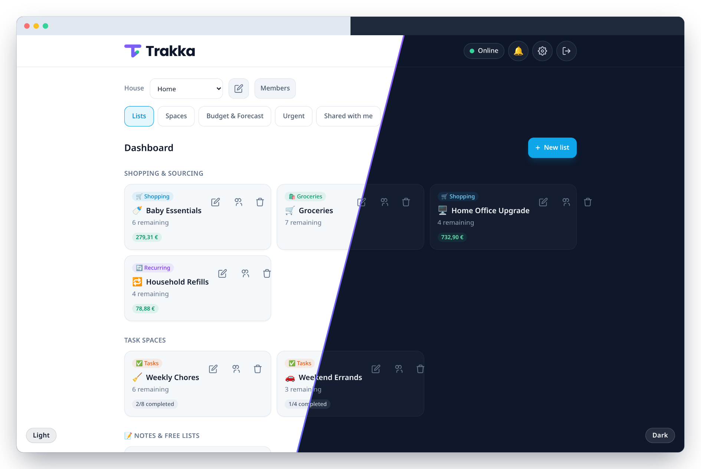
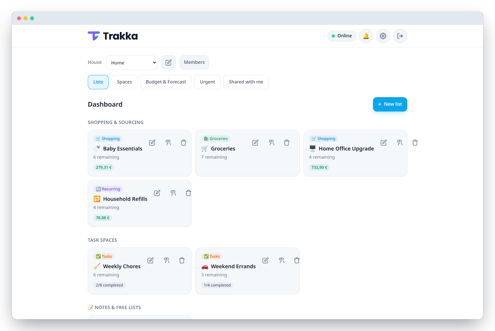
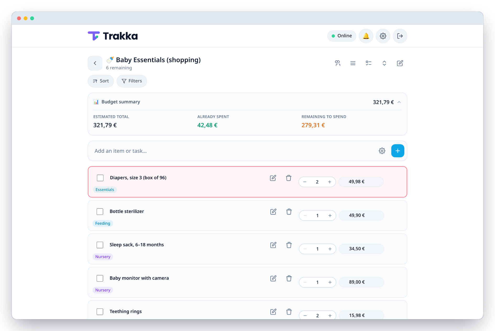
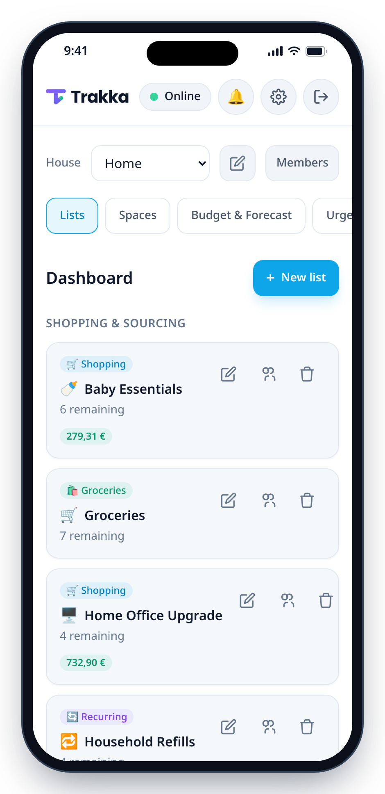
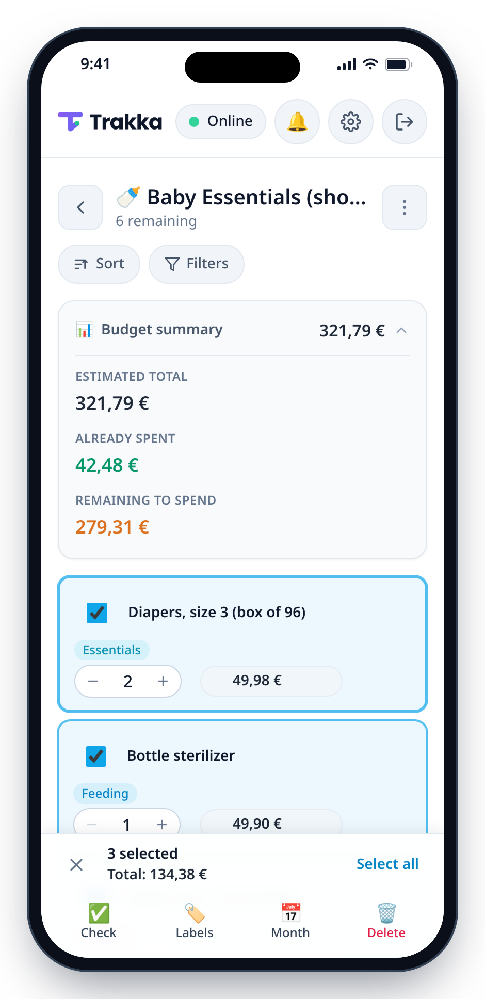
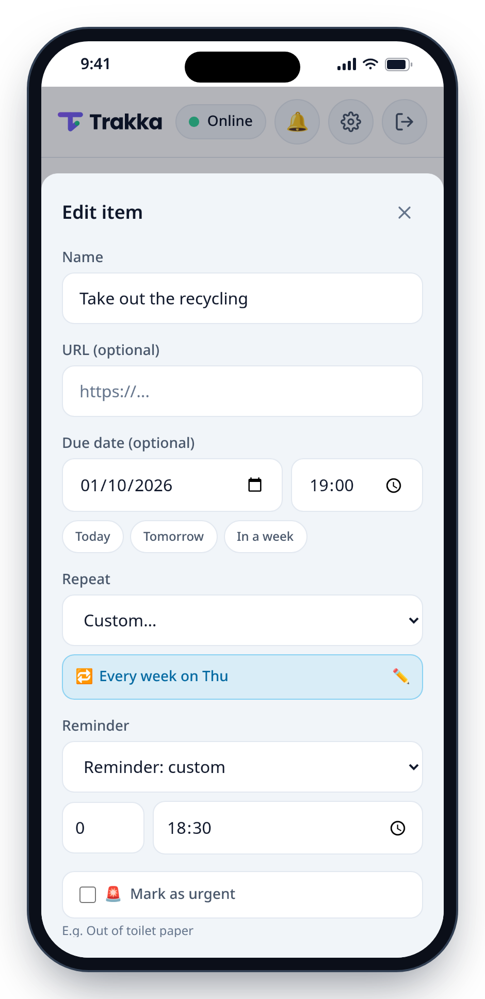

<p align="center">
  <picture>
    <source media="(prefers-color-scheme: dark)" srcset="static/icons/trakka-lockup-dark-bg.svg">
    
  </picture>
</p>

<p align="center">
  <strong>Self-hosted shopping lists, to-dos and household budgets — in a single tiny Go binary.</strong><br>
  An offline-first PWA for your phone, a clean JSON API for everything else, and under 20&nbsp;MB of RAM.
</p>

<p align="center">
  <a href="https://github.com/Trakka-project/Trakka/actions/workflows/ci.yml"></a>
  
  
  
  
  <a href="LICENSE"></a>
</p>

<p align="center">
  
</p>

## Showcase

### On the desktop

The screenshots below follow your GitHub theme.

<p align="center">
  <picture>
    <source media="(prefers-color-scheme: dark)" srcset="docs/assets/desktop-dark.png">
    <source media="(prefers-color-scheme: light)" srcset="docs/assets/desktop-light.png">
    
  </picture>
  <br>
  <sub>The dashboard groups shopping, task and free-form lists, with what's left to buy or do in each.</sub>
</p>

<p align="center">
  <picture>
    <source media="(prefers-color-scheme: dark)" srcset="docs/assets/desktop-list-dark.png">
    <source media="(prefers-color-scheme: light)" srcset="docs/assets/desktop-list-light.png">
    
  </picture>
  <br>
  <sub>Every shopping list tracks its own budget: estimated total, already spent, and what's left to spend.</sub>
</p>

### On your phone

Trakka installs as an app on iOS, iPadOS and Android and keeps working offline.

<table>
  <tr>
    <td align="center" width="33%">
      <picture>
        <source media="(prefers-color-scheme: dark)" srcset="docs/assets/showcase-mobile-home-dark.png">
        
      </picture>
    </td>
    <td align="center" width="33%">
      <picture>
        <source media="(prefers-color-scheme: dark)" srcset="docs/assets/showcase-mobile-selection-dark.png">
        
      </picture>
    </td>
    <td align="center" width="33%">
      <picture>
        <source media="(prefers-color-scheme: dark)" srcset="docs/assets/showcase-mobile-recurrence-dark.png">
        
      </picture>
    </td>
  </tr>
  <tr>
    <td align="center"><strong>🏠 Home</strong><br><sub>All lists at a glance, with what's left to buy or do.</sub></td>
    <td align="center"><strong>☑️ Selection &amp; bulk actions</strong><br><sub>Long-press to select; check, label, schedule or delete in one go.</sub></td>
    <td align="center"><strong>🔁 Recurring tasks &amp; reminders</strong><br><sub>Repeat rules, due times and push reminders per task.</sub></td>
  </tr>
</table>

## Features

- 🛒 **Lists for every job**: one-off shopping, day-to-day groceries, recurring purchases, to-dos and free-form notes, each showing the fields that fit it.
- 💶 **Budgets and forecasting**: per-item prices and quantities, a live budget summary per list, and a *Budget & Forecast* view that plans purchases by month.
- 🔁 **Recurring tasks**: daily, weekly (on chosen weekdays), monthly or yearly rules with intervals and end dates; checking one off schedules the next occurrence.
- 🔔 **Reminders and Web Push**: per-task reminders (same day, the day before, a custom offset, or the exact due time), with optional vibration.
- ☑️ **Bulk actions**: multi-select to check, label, reschedule or delete many items at once, with a running total of what's selected.
- 🏷️ **Organize and focus**: labels, filters, sorting, custom *Spaces* (categories), an *Urgent* view, and drag-to-reorder.
- 📉 **Price tracking**: attach a product URL to fetch its price and image in the background, and get alerted when it drops below a target price.
- 👨‍👩‍👧 **Households and sharing**: houses with members and roles, plus read or write sharing of single lists or whole Spaces, pinnable to the dashboard.
- 📱 **Offline-first PWA**: app-shell caching and an IndexedDB sync queue, so edits made offline are replayed once the connection is back.
- 🌗 **Light, dark or auto theme**, and an **English/French** interface.
- 🔐 **Accounts your way**: local email and password (bcrypt) or any OIDC provider (Authelia, Authentik, Keycloak, Google…), plus an admin console.
- 🛡️ **Secure by construction**: parameterized SQL only, strict URL validation, SSRF-guarded outbound requests, CSRF checks, and a strict Content-Security-Policy.
- 🪶 **Lightweight**: a single static binary with pure-Go SQLite (no CGO), under 20 MB of RAM, running as a non-root container under Docker or rootless Podman.

## Quick start

### Docker / Podman

```bash
docker compose up -d --build
# or
podman-compose up -d
```

Open `http://localhost:8080` and create the first account; it becomes the instance admin. Data persists in the `trakka_data` named volume.

To also start the optional [Radicale](https://radicale.org/) CalDAV server:

```bash
docker compose --profile calendar up -d
```

### Local (no container)

Requires Go 1.27.0+.

```bash
go build -o trakka ./cmd/server
DB_PATH=./trakka.db STATIC_DIR=./static TEMPLATES_DIR=./templates ./trakka
```

Configuration is environment variables only; see [docs/DEPLOYMENT.md](docs/DEPLOYMENT.md) for the full list, HTTPS, OIDC and push notification setup.

## Architecture at a glance

```
Browser / installed PWA ──► net/http (stdlib) ──► internal/handlers ──► internal/db ──► SQLite (modernc.org, no CGO)
   service worker +              security headers,       auth, RBAC,          parameterized
   IndexedDB sync queue          CSRF, sessions          validation           queries only
                                                         │
                                  background workers ────┴─► price scraper · Web Push · WebDAV backups
```

| Component | Choice | Why |
|---|---|---|
| HTTP server | `net/http` (stdlib) | No router dependency; Go 1.22+ method-based `ServeMux` patterns are enough |
| Database | [`modernc.org/sqlite`](https://pkg.go.dev/modernc.org/sqlite) | Pure-Go SQLite driver, so the binary stays static and portable; versioned migrations |
| Logging | `log/slog` (stdlib) | Structured JSON logs with no dependency |
| Frontend | Vanilla JavaScript + Tailwind CSS 3 (vendored Play runtime) | No framework and no build step; served straight from `static/` |
| Container | `golang:1.27.0-alpine` build → distroless runtime | Minimal image, fixed non-root UID, read-only root filesystem |

```
cmd/server/          entry point: config, wiring, graceful shutdown
internal/            config, db, handlers, auth, validate, recurrence, scraper, webpush, backup, …
static/              PWA frontend: index.html, js/, css/, sw.js, manifest.json, locales/, icons/
templates/           server-rendered login page
docs/                reference documentation (see below)
```

## Documentation

| Guide | What's inside |
|---|---|
| [API reference](docs/API.md) | Every REST endpoint, with request and response examples |
| [Database](docs/DATABASE.md) | SQLite schema, data model and migrations |
| [Deployment](docs/DEPLOYMENT.md) | Docker/Podman, configuration, rootless notes |
| [Development](docs/DEVELOPMENT.md) | Local setup, building, project layout, pre-commit hooks |
| [PWA & offline](docs/PWA.md) | Service worker, IndexedDB sync queue, iOS/Android specifics |
| [Installing the app](docs/INSTALLATION.md) | Adding Trakka to the home screen on iOS/iPadOS and Android |
| [Push notifications](docs/DOC_PUSH_NOTIFICATIONS.md) | VAPID keys, HTTPS prerequisites, troubleshooting |
| [Security audit](docs/AUDIT.md) | Findings and fixes from the last audit |

The screenshots above are generated by [`scripts/generate-showcase-images.js`](scripts/generate-showcase-images.js); see [scripts/README.md](scripts/README.md) to regenerate them.

<details>
<summary><strong>Visual identity</strong></summary>

Trakka's mark is "Le T-Coche": a geometric T whose vertical stroke breaks into a diagonal checkmark, with an emerald dot at the tip standing for sync/online status.

| Role | Hex |
|---|---|
| Background | `#0f172a` |
| Deep background | `#0b0f19` |
| Surface / cards | `#1e293b` |
| Accent — indigo | `#6366f1` |
| Accent — violet | `#8b5cf6` |
| Symbol gradient | 135°, `#8b5cf6` → `#6366f1` |
| Success / online | `#10b981` (light `#34d399`) |
| Text | `#f8fafc` · muted `#94a3b8` · subtle `#64748b` |

These are the same values exposed as CSS custom properties in [static/css/tokens.css](static/css/tokens.css) (`--tk-bg`, `--tk-accent`, `--tk-success`, ...), so the app UI and the brand palette never drift apart.

**Emerald is a status signal, not a decorative color**: it's reserved for completed/validated states and "online" badges. Using it elsewhere drains it of meaning.

Logo usage:

- Minimum size: **16px** for the symbol alone, **96px wide** for the horizontal lockup. Below that, use the symbol alone rather than an illegible lockup.
- Clear space around the lockup: the height of the T's stroke on all four sides.
- Use `trakka-lockup-light-bg.svg` on light backgrounds and `trakka-lockup-dark-bg.svg` on dark ones (see [static/icons/](static/icons/)). Don't recolor the symbol, add shadows/outlines/glow, or stretch it non-proportionally. The lockup word is already vectorized to curves, so no typeface is required to render it.

</details>

## Contributing

See [CONTRIBUTING.md](CONTRIBUTING.md) for how to set up a dev environment, the project's coding conventions, and the pull request process.

## License

Trakka is licensed under the [GNU General Public License v3.0](LICENSE).
